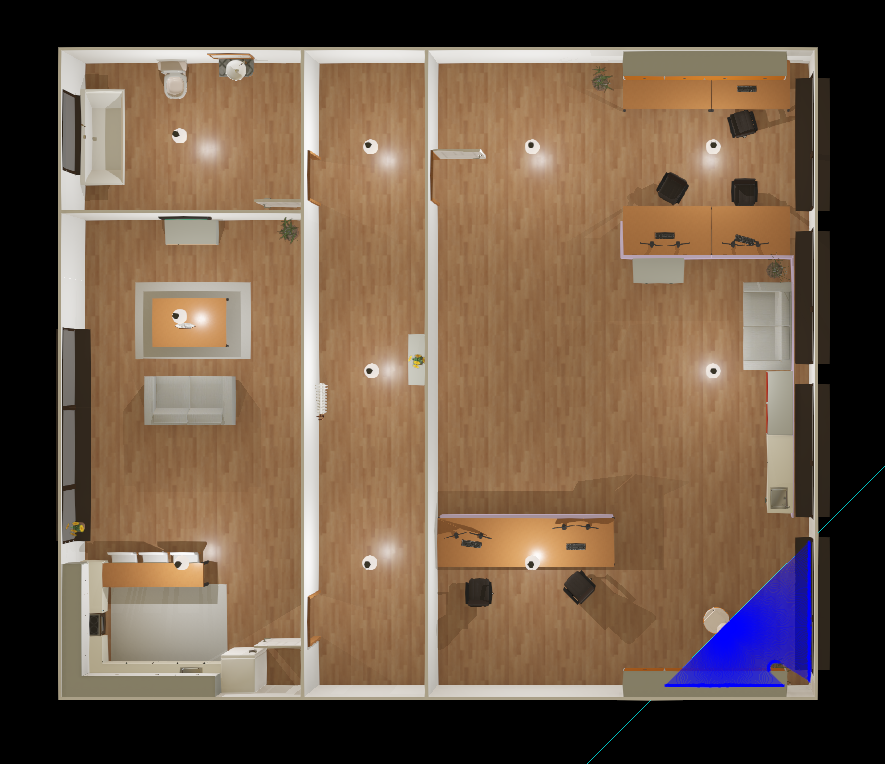
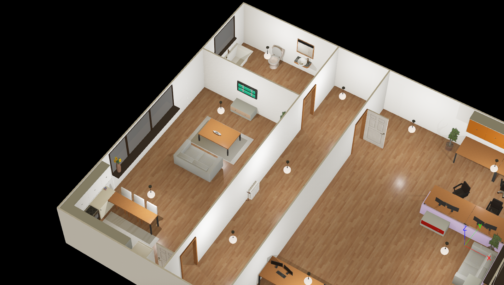
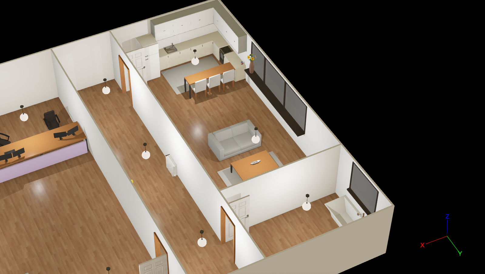
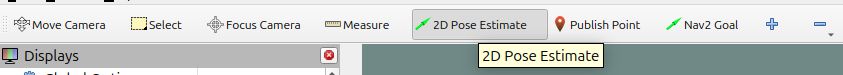
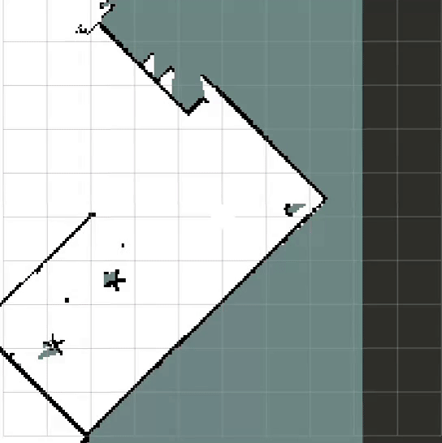
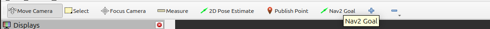
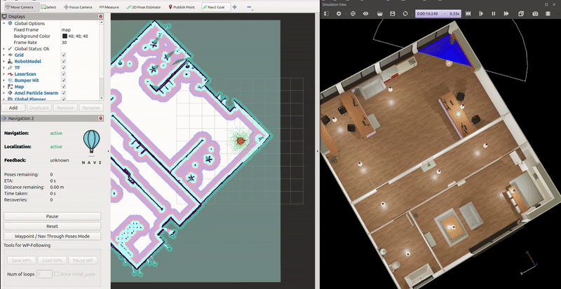
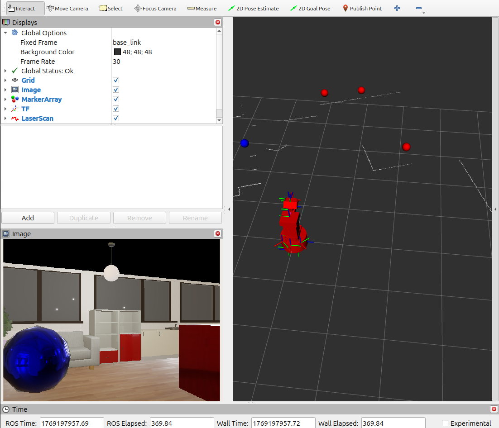
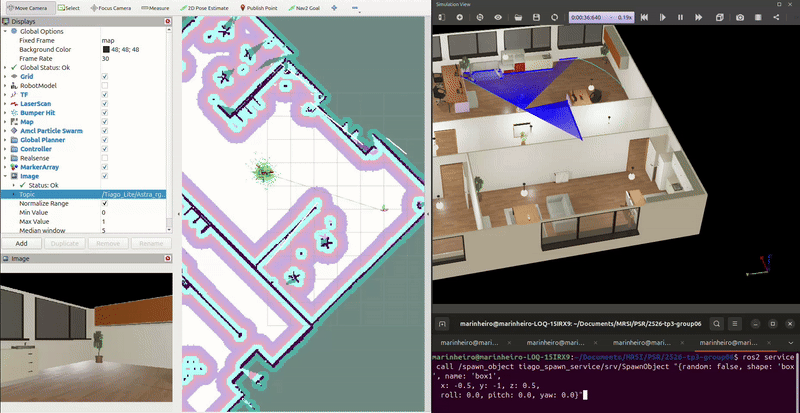

# Robot Navigation with ROS 2 and Webots (TIAGo)

## Project Description
The objective of this project is to build a small robot application in ROS 2 using a simulated TIAGo robot in Webots, focusing on robotic navigation, and perception. The robot has a mobile base, a LiDAR sensor and an RGB-D camera.

# Task 1 - Extending the Environment

The goal of this task was to edit the simulation world to create a larger environment with multiple rooms (bedrooms, kitchen, living room, office, etc.) and ensure the TIAGo robot can navigate through all of them.

## How to Visualize
To launch the simulation world and use the teleoperation to verify the environment, execute:

```bash
ros2 launch psr_ros2_tiago worldTest_launch.py
```
This opens the extended house environment in Webots along with Rviz and provides keyboard teleoperation.


## World Views

Here are some views of the constructed world showing the different compartments:

### Top View


### Perspective Views
<p float="left">
  
   
</p>

# Task 2 - Mapping with SLAM

The goal of this task is to use a 2D SLAM node to build a complete occupancy grid map of the extended house environment. The robot is teleoperated through all rooms to allow the algorithm to construct a precise map.

## Requirements
* **SLAM Setup:** Uses a 2D SLAM package (Iris LaMa) configured for the TIAGo robot.
* **Sensor Integration:** The node subscribes to laser scans (`/scan`) and robot odometry/TF.
* **Visualization:** RViz is used to monitor the map building process, laser scans, and the robot model.

---

## 1. How to Start the SLAM Node and Teleoperation
To launch the simulation world, the SLAM node, and the teleoperation node from a single command, execute:

```bash
ros2 launch tiago_slam slam_launch.py
```
This launch file starts:

- **Webots Simulation:** Opens the TIAGo robot in the task1.wbt world.
- **SLAM Node:** Runs the slam2d_ros node from the iris_lama_ros package.
- **Teleoperation:** Opens a dedicated terminal to control the robot using the keyboard.
- **RViz:** Pre-configured with the necessary displays (Map, LaserScan, TF, and Robot Model).

## 2. How to Teleoperate the Robot
Once the terminal opens, use the following keys to explore all rooms (original and new):

- **w/s:** Move forward / backward
- **a/d:** Rotate left / right
- **1/2/3:** Change speed (Slow / Normal / Fast)
- **ESC:** Stop and exit

## 3. How to Save the Map
After exploring the environment and ensuring the map is complete with minimal holes and distortions, run the following command in a new terminal:

```bash
ros2 run nav2_map_server map_saver_cli -f src/tiago_slam/maps/final_map --ros-args -p save_map_timeout:=20.0 -p use_sim_time:=true -p map_subscribe_transient_local:=false
```

 > **Note:** The `save_map_timeout` parameter is increased to ensure the map saver waits long enough for the map message.

This will generate two files in the `maps/` directory:

- **final_map.pgm:** The occupancy grid image.

- **final_map.yaml:** The map configuration file.


# Task 3 - TIAGo Navigation

Autonomous navigation system for TIAGo robot using Nav2 and AMCL localization.

## Features

- **2D Localization**: AMCL-based localization on saved map
- **Autonomous Navigation**: Nav2 stack with collision avoidance
- **Semantic Navigation**: Navigate to named locations (bedroom, kitchen, etc.)
- **Action-based Interface**: NavigateToPose action with feedback
- **Multiple Goal Methods**: Topic, service, or RViz interface

## 1. Installation & Build

### Dependencies

```bash
sudo apt install ros-$ROS_DISTRO-nav2-bringup \
                 ros-$ROS_DISTRO-nav2-amcl \
                 ros-$ROS_DISTRO-navigation2 \
                 ros-$ROS_DISTRO-slam-toolbox
```

### Build

```bash
colcon build 
source install/setup.bash
```

## 2. Usage

### 2.1 Launch Navigation System

```bash
ros2 launch tiago_navigation navigation_launch.py
```

This starts:
- Webots simulation with TIAGo
- Nav2 navigation stack
- AMCL localization
- Semantic navigation node
- RViz with navigation displays
- Cmd Vel Converter Node (Twist to TwistStamped)

### 2.2 Set Initial Pose

1. In RViz, click **2D Pose Estimate**
   
   

2. Click and drag on map where robot is located
3. Wait for particle cloud to converge
   
   

### 2.3 Set 2D Goal

1. In RViz, click **Nav2 Goal**

2. Click and drag the position where you want the robot goes
3. Robot start moving and you can see the status of navigation on left side bar




### 2.4 Navigate to Semantic Locations

**Via Topic:**
```bash
ros2 topic pub /go_to_location std_msgs/msg/String "{data: <location_name>}" --once
```


## 3. System Interfaces

### Available Locations

- `bathroom`
- `kitchen`
- `living_room`
- `hallway`
- `office`

### Topics

| Topic | Type | Description |
|-------|------|-------------|
| `/go_to_location` | std_msgs/String | Send semantic location name |
| `/navigation_status` | std_msgs/String | Navigation status updates |
| `/scan` | sensor_msgs/LaserScan | LiDAR scans |
| `/odom` | nav_msgs/Odometry | Odometry |
| `/map` | nav_msgs/OccupancyGrid | Map from SLAM |
| `/cmd_vel` | geometry_msgs/Twist | Velocity commands |
| `/plan` | nav_msgs/Path | Global path |

### Actions

| Action | Type | Description |
|--------|------|-------------|
| `/navigate_to_pose` | nav2_msgs/action/NavigateToPose | Navigate to goal pose |

## 4. Configuration Files

- `config/nav2_params.yaml` - Nav2 stack parameters
- `config/locations.yaml` - Semantic location definitions

## 5. Troubleshooting

### Robot Not Moving
```bash
# List all lifecycle nodes
ros2 lifecycle nodes

# Check the state of a specific lifecycle node (e.g. bt_navigator)
ros2 lifecycle get /bt_navigator

# Verify publishers and subscribers on /cmd_vel topic
ros2 topic info /cmd_vel --verbose
```


# Task 4 – Perception

## Objective
The objective of this task is to implement a perception node that detects objects in the environment using the robot’s RGB-D camera. Objects are identified based on color and their detections are published so they can be visualized and used by other nodes.

---

## Perception Node Description

The perception node subscribes to the RGB camera image of the TIAGo Lite robot and performs color-based detection using OpenCV.

### Subscribed Topics
- `/Tiago_Lite/Astra_rgb/image_color` (`sensor_msgs/Image`)
  RGB image from the robot’s camera.
- `/Tiago_Lite/Astra_depth/image` (`sensor_msgs/Image`)
  Depth image for distance estimation.

### Published Topics
- `/detected_objects` (`std_msgs/String`)  
  Publishes information about the detected objects in the format:
  `<color> cx=<center_pixel_x> cy=<center_pixel_y> dist=<distance>`

- `/detected_objects_markers` (`visualization_msgs/MarkerArray`)  
  Publishes RViz markers representing detected objects.

---

## Detection Method

- The RGB image from the robot's camera is converted to HSV color space.
- Two color ranges are detected by applying masks:
  - **Red**
  - **Blue**
- Contours are extracted from the color masks.
- Small contours are filtered out using an area threshold.
- The centroid and bounding box area of each valid contour are computed.
- **Distance Estimation:** The depth image is sampled at the centroid coordinates to determine the real-world distance to the object.

---

## Visualization in RViz

Detected objects are visualized using spherical markers:
- **Red markers** represent detected red objects (boxes)
- **Blue markers** represent detected blue objects (spheres)

Marker positions are computed from image pixel coordinates and depth data, then published in the `base_link` frame.



---

## Launching Task 4

A single launch file starts:
- Webots with the TIAGo Lite robot
- The perception node
- RViz with a predefined configuration

### Command
```bash
ros2 launch tiago_perception perception.launch.py
```
After launching:
- Webots opens with the simulated environment
- The perception node starts processing camera images
- RViz displays detected objects as markers

---

## Validation

Task 4 is validated by:
- Observing published detection logs by using:
  - ```bash
    ros2 topic echo /detected_objects
    ```
- Visual confirmation of markers appearing in RViz
- Correct color association between spawned objects and detected markers

---

# Task 5 – Dynamic Object Spawning

## Objective
The objective of this task is to dynamically add new objects to the simulation using the Webots supervisor. Objects can be spawned either at random positions or at user-defined poses.

---

## Spawner Node Description
A service-based node is implemented to request object spawning through the Webots supervisor service.

### Supervisor Service Used:
- `/Ros2Supervisor/spawn_node_from_string`
The service allows sending a Webots node description as a string, which is then inserted into the simulation.

--- 

## Custom Spawn Service
A custom service is provided to the user with the `tiago_spawn_service` package.

### Service Name
`/spawn_object`

### Service interface:

```bash
Service Definition
bool random

string shape
string name

float32 x
float32 y
float32 z

float32 roll
float32 pitch
float32 yaw
---
bool success
string message
```

### Supported Objects
Two object types are supported:
- Box
  - Size: 1 × 1 × 1
  - Color: Red
- Sphere
  - Radius: 0.5
  - Color: Blue
The colors are chosen to match the perception system used in Task 4.

---

## Pose and Orientation
Objects can be spawned:
- At a random pose
- At a user-specified pose

---

## Launching Task 5
With webots already running, the spawner node is launched using:
```bash
ros2 launch tiago_spawner spawn.launch.py
```
---

## Spawn Service Calls
Spawn a box at a fixed pose:
```bash
ros2 service call /spawn_object tiago_spawn_service/srv/SpawnObject \
"{random: false, shape: 'box', name: 'box1',
  x: -0.5, y: -1.0, z: 0.5,
  roll: 0.0, pitch: 0.0, yaw: 0.0}"
```
Spawn a sphere at a random pose:
```bash
ros2 service call /spawn_object tiago_spawn_service/srv/SpawnObject \
"{random: true, shape: 'sphere', name: 'sphere1',
  x: 0.0, y: 0.0, z: 0.0,
  roll: 0.0, pitch: 0.0, yaw: 0.0}"
```




